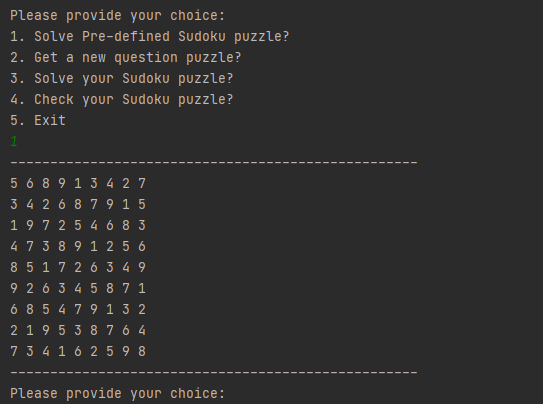
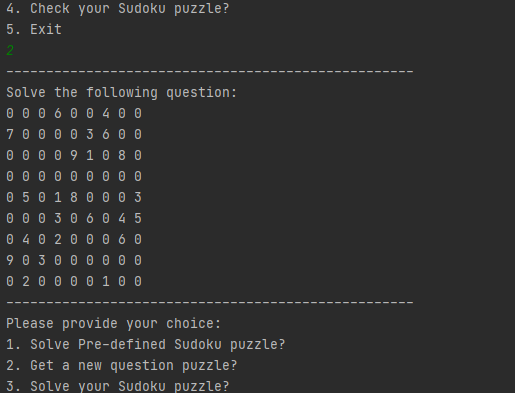
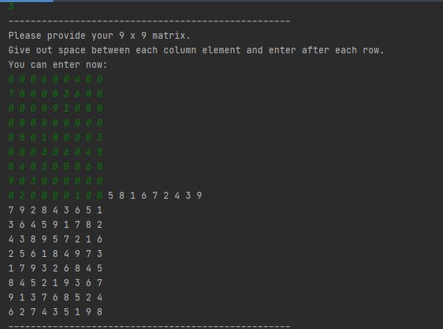
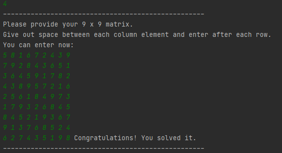
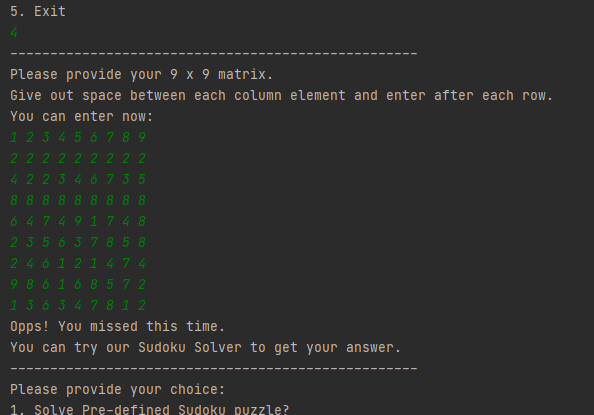
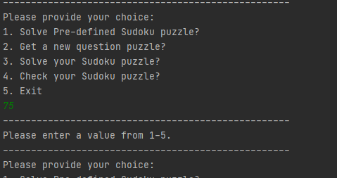
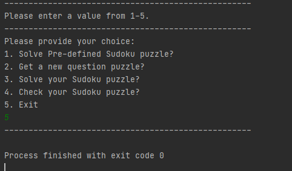

# Sudoku Game with Java-core
## A Console Game application which allows users to solve pre-defined puzzle, get a random question from a list of questions, solve sudoku puzzle added by user and check for a given puzzle.

## Problem Statement:
### All Tasks:
<ol>
  <li>Solve Pre-defined Sudoku puzzle.</li>
  <li>Get a new question puzzle.</li>
  <li>Solve user Sudoku puzzle.</li>
  <li>Check user Sudoku puzzle.</li>
</ol>

## Technologies used: 
- Java - Core

## Word Doc:
Click <a href="Final Project - Sudoku.docx" target="_blank">here</a> for word document.

## Screenshots : 
### All

